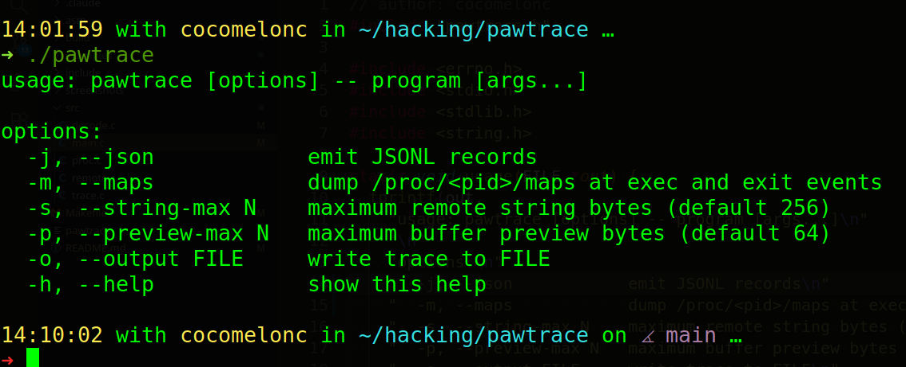
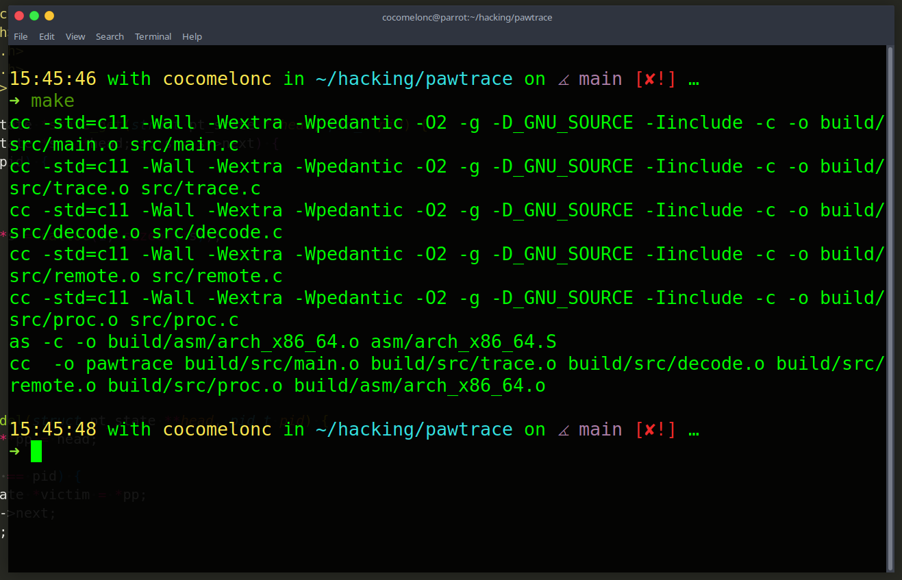
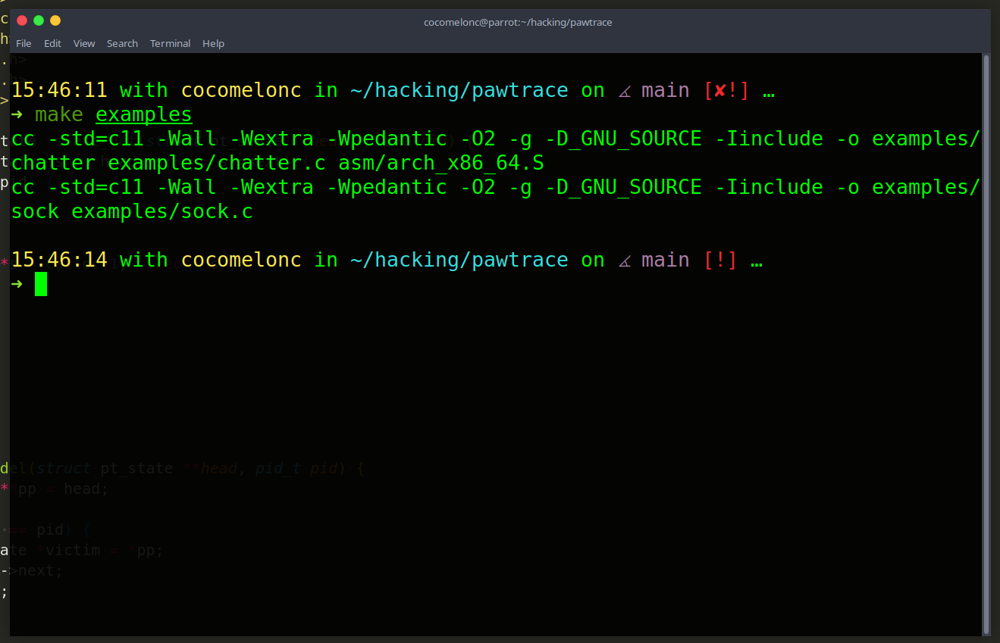
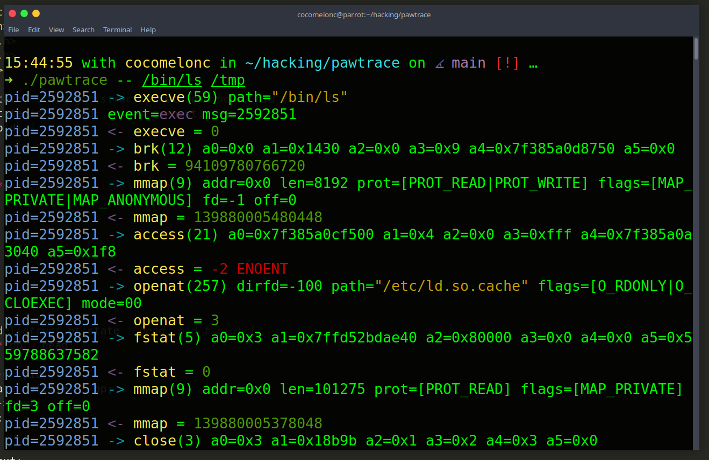

# pawtrace

my tiny project `pawtrace` - is a Linux x86-64 syscall tracing sandbox written in C with a small assembly support layer.     

    

It launches a program under `ptrace`, follows forks/clones, pairs syscall enter/exit stops, decodes common syscall arguments, reads traced process memory for paths and small buffer previews, and can snapshot `/proc/<pid>/maps` around exec/exit events.    

This is intended for defensive research, reverse engineering practice, binary behavior auditing, and red-team lab validation of what a process actually does at the syscall layer. It does not inject code, bypass controls, hide processes, or modify traced programs.    

## build

```bash
make
```

`make` produces a debug build (with `-g`). use `make release` for a stripped binary (no symbols/debug info, ~60% smaller on disk).

    

```bash
make examples
```

    

## usage

```sh
./pawtrace -- /bin/ls /tmp
./pawtrace -m -- examples/chatter
./pawtrace -- examples/sock
./pawtrace -j -o trace.jsonl -- /usr/bin/true
```

    

options:

`-j`, `--json`: emit JSONL records.    
`-m`, `--maps`: dump `/proc/<pid>/maps` at exec and exit events.    
`-s`, `--string-max N`: cap remote string reads.    
`-p`, `--preview-max N`: cap read/write buffer previews.    
`-o`, `--output FILE`: write trace output to a file.    
`-h`, `--help`: show usage.    

`-s`, `-p`, and `-o` each require an argument; pawtrace exits with an error if it is missing. `N` must be in the range 1..1048576.    

## technical notes

on x86-64 Linux, syscall arguments are read from `rdi`, `rsi`, `rdx`, `r10`, `r8`, and `r9`; the syscall number is in `orig_rax`; the return value is in `rax`. `pawtrace` stores the enter-side frame so the exit-side return value can be interpreted with the original arguments.    

the tracer uses:    

`PTRACE_TRACEME` for the initial child.   
`PTRACE_O_TRACESYSGOOD` to distinguish syscall stops from normal `SIGTRAP`.   
`PTRACE_O_TRACEFORK`, `PTRACE_O_TRACEVFORK`, and `PTRACE_O_TRACECLONE` to follow process trees.   
`PTRACE_O_TRACEEXEC` and `PTRACE_O_TRACEEXIT` for lifecycle context.   
`process_vm_readv` first for remote memory reads, with `PTRACE_PEEKDATA` as a fallback.   

the assembly file provides raw syscall and timestamp helpers:       

`pt_raw_syscall6`   
`pt_gettid_raw`   
`pt_rdtsc`   

## useful next extensions

add an attach mode with `PTRACE_SEIZE`.   
add socket address decoding for `recvfrom` and `accept` (exit-side, the address is an output).    
add a dump of the observed syscall set at exit (seccomp allowlist seed).    
add richer JSON argument decoding instead of raw numeric args.    

`connect`, `bind`, and `sendto` already decode the destination address (`inet`/`inet6`/`unix`).    
